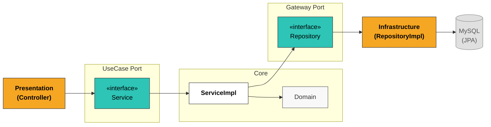
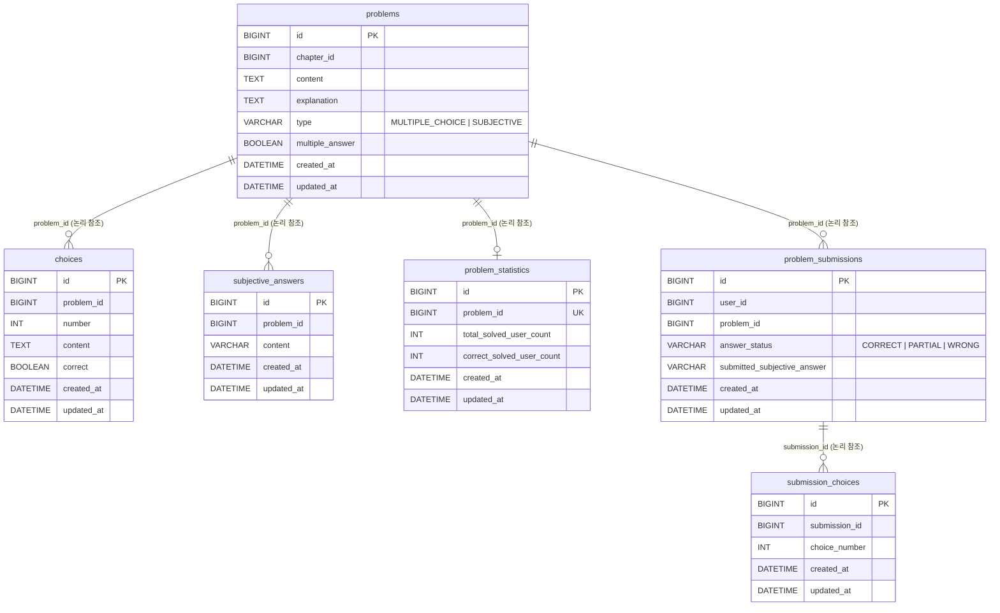
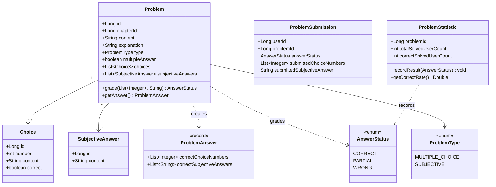

# Diagrams

## Architecture

| 색상 | 분류 | 설명 |
|------|------|------|
| 주황 | Humble | 프레임워크/인프라에 종속 — 단독 테스트 어려움 |
| 청록 | Port (interface) | 레이어 경계. 의존 역전의 기준점 |
| 흰색 | Core (ServiceImpl) | 비즈니스 로직 — 단독 테스트 가능 |
| 연회색 | Domain / Persistence | 도메인 객체, JPA 인프라 |

## ERD

JPA `@ManyToOne` 연관관계를 사용하지 않고 `Long` 타입 ID로만 참조합니다. Hibernate FK 제약 조건이 생성되지 않으며, 모든 관계는 애플리케이션 레벨에서 관리됩니다.

| 인덱스 이름 | 테이블 | 컬럼 | 종류 |
|---|---|---|---|
| `idx_problem_chapter` | `problems` | `chapter_id` | INDEX |
| `idx_choice_problem` | `choices` | `problem_id` | INDEX |
| `idx_subjective_problem` | `subjective_answers` | `problem_id` | INDEX |
| `uk_submission_user_problem` | `problem_submissions` | `(user_id, problem_id)` | UNIQUE |
| `idx_submission_choice_submission` | `submission_choices` | `submission_id` | INDEX |
| `uk_problem_statistic_problem_id` | `problem_statistics` | `problem_id` | UNIQUE |

## Domain Model

## ERD vs 도메인 모델

| DB (ERD) | 도메인 모델                                            | 이유 |
|----------|---------------------------------------------------|------|
| `choices`, `subjective_answers` 별도 테이블 | `Problem.choices`, `Problem.subjectiveAnswers` 필드 | DB는 정규화를 위해 분리하지만, 도메인에서 Problem은 자신의 선택지를 소유 |
| `submission_choices` 테이블 | `ProblemSubmission.submittedChoiceNumbers` 필드     | 제출 선택지는 단순 정수 목록이라 별도 도메인 객체가 불필요. DB에만 정규화된 테이블로 존재 |
| 없음 | `ProblemAnswer` (record)                          | 채점 시점에 조립되는 순간적 결과값. 저장할 필요 없는 순수 도메인 개념 |
| `problem_statistics` 별도 테이블 | `ProblemStatistic` 도메인 객체                         | 정답률 집계 성능을 위해 분리된 테이블. 도메인에서도 독립 객체로 모델링 |
| `type VARCHAR` | `ProblemType` enum                                | DB는 문자열로 저장, 도메인은 타입 안전성을 위해 열거형으로 표현 |
| `answer_status VARCHAR` | `AnswerStatus` enum                               | 위와 동일 |
